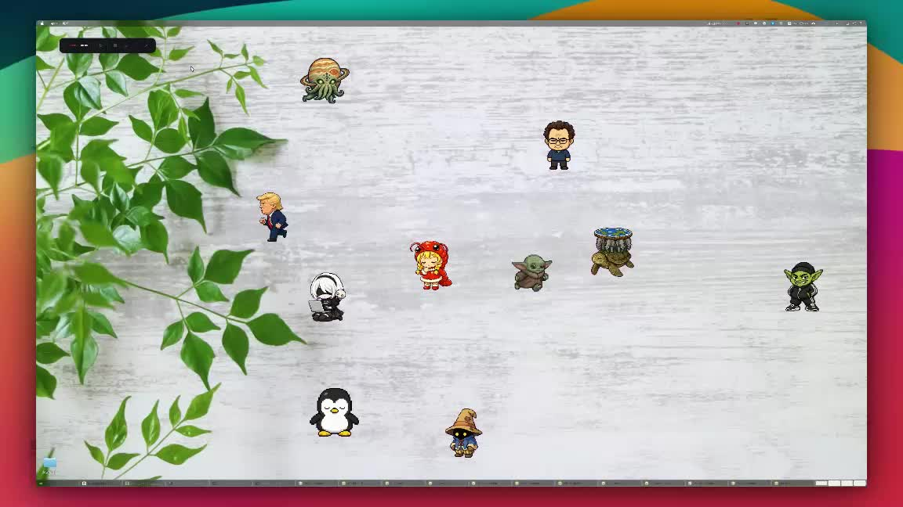

<h1 align="center">Pet Companion</h1>

<p align="center">
  A standalone animated pet overlay for AI coding agents.
</p>

<p align="center">
  <a href="README.md"></a>
  <a href="README_JP.md"></a>
</p>

<p align="center">
  
  
  
  
  
  
</p>



## ✨ Features

- 8 bundled pets including Clippy, Dario, Tux, YoRHa 2B, and more
- User pet discovery from `~/.config/pet-companion/pets/` and `~/.codex/pets/`
- Codex 8x9 atlas animation switching for idle, waving, running, jumping, failed, waiting, and review states
- Desktop-wide draggable overlay mode on Linux
- Browser mode for simpler development and fallback usage
- Real-time event reactions over Server-Sent Events (SSE)
- Speech bubble customization with `bubbleBg` and `bubbleText`
- Hook-based integration with Claude Code, Codex CLI, or manual `pet-companion emit`

## 🚀 Quick Start

```bash
cd pet-companion
pipx install -e .

# Start the default desktop overlay
pet-companion start

# Start in a normal browser tab instead
pet-companion start --browser

# Force the Electron overlay backend
pet-companion start --overlay-backend electron
```

The default `start` command now prefers the Electron desktop overlay.
On Linux, it falls back to GTK if Electron is unavailable.
Use `--browser` if you want the in-browser mode.

## 🪟 Electron Overlay

Electron is the recommended path for Windows / macOS support and also
works on Linux as an alternative to GTK.

Install the desktop dependencies once:

```bash
cd desktop
npm install
```

Then launch it through the Python CLI:

```bash
pet-companion start --overlay-backend electron
```

Available backends:

- `auto`
  Prefer Electron, then GTK on Linux, then browser
- `gtk`
  Force the Linux GTK overlay fallback
- `electron`
  Force the Electron overlay shell
- `browser`
  Open a normal browser window

## 🖥️ Overlay Mode

The project currently has two desktop overlay implementations:

- Electron
  Cross-platform primary backend for Windows, macOS, and Linux
- GTK
  Linux-specific fallback backend

GTK overlay mode is implemented with Linux-specific desktop features:

- GTK3 for native transparent top-level windows
- WebKit2GTK for rendering the pet UI
- X11 input shaping for click-through behavior on the main transparent window
- A native GTK drag handle window for reliable desktop-wide dragging

Notes:

- Electron is now the primary desktop backend.
- GTK remains available as a Linux fallback.
- The implementation forces `GDK_BACKEND=x11` to support transparent overlay behavior reliably.
- Browser mode works as a fallback when overlay dependencies are unavailable.

## 🧰 CLI

```bash
pet-companion start [--pet tux]                    # Start the default desktop overlay
pet-companion start --browser [--pet tux]          # Start in a normal browser
pet-companion start --overlay-backend gtk          # Force GTK overlay on Linux
pet-companion start --overlay-backend electron     # Force Electron overlay
pet-companion emit <event-type> [options]          # Send an event
pet-companion list                                 # List available pets
pet-companion install-hooks <agent>                # Show hook config for an agent
```

### Event Types

- `idle`
  Agent stopped or session is idle
- `thinking`
  User submitted a prompt
- `tool-use`
  Agent invoked a tool
- `tool-result`
  Tool finished; use `--status success` or `--status error`
- `failed`
  Unrecoverable error
- `review`
  Agent is waiting for approval or review

Examples:

```bash
pet-companion emit thinking --port 19822
pet-companion emit tool-use --port 19822
pet-companion emit tool-result --status error --message "Build failed" --port 19822
pet-companion emit idle --port 19822
```

## 🔌 Agent Integration

### Claude Code

Add to `~/.claude/settings.json` under the `hooks` key:

```json
{
  "hooks": {
    "UserPromptSubmit": [
      {
        "hooks": [
          {
            "type": "command",
            "command": "pet-companion hook-emit user-prompt-submit --port 19822",
            "timeout": 30
          }
        ]
      }
    ],
    "PreToolUse": [
      {
        "hooks": [
          {
            "type": "command",
            "command": "pet-companion hook-emit pre-tool-use --port 19822",
            "timeout": 30
          }
        ]
      }
    ],
    "PostToolUse": [
      {
        "hooks": [
          {
            "type": "command",
            "command": "pet-companion hook-emit post-tool-use --port 19822",
            "timeout": 30
          }
        ]
      }
    ],
    "Stop": [
      {
        "hooks": [
          {
            "type": "command",
            "command": "pet-companion hook-emit stop --port 19822",
            "timeout": 30
          }
        ]
      }
    ]
  }
}
```

### Codex CLI

Add to `~/.codex/hooks.json` under the `hooks` key:

```json
{
  "hooks": {
    "UserPromptSubmit": [
      {
        "hooks": [
          {
            "type": "command",
            "command": "pet-companion hook-emit user-prompt-submit --port 19822",
            "timeout": 5
          }
        ]
      }
    ],
    "PreToolUse": [
      {
        "hooks": [
          {
            "type": "command",
            "command": "pet-companion hook-emit pre-tool-use --port 19822",
            "timeout": 5
          }
        ]
      }
    ],
    "PostToolUse": [
      {
        "hooks": [
          {
            "type": "command",
            "command": "pet-companion hook-emit post-tool-use --port 19822",
            "timeout": 5
          }
        ]
      }
    ],
    "Stop": [
      {
        "hooks": [
          {
            "type": "command",
            "command": "pet-companion hook-emit stop --port 19822",
            "timeout": 5
          }
        ]
      }
    ]
  }
}
```

How it works:

- Codex command hooks pass one JSON object on `stdin`
- `pet-companion hook-emit ...` reads that hook payload directly
- For `PostToolUse`, it tries to extract tool metadata and message text from fields such as `tool_name`, `tool_input`, and `tool_response`
- If `tool_response.message` is present, that text is forwarded to the pet speech bubble

In other words, this:

```json
{
  "tool_name": "Bash",
  "tool_response": {
    "success": false,
    "message": "Build failed"
  }
}
```

is converted internally into an emit call equivalent to:

```bash
pet-companion emit tool-result --status error --message "Build failed" --port 19822
```

## 🐾 Custom Pets

Pet Companion discovers pets from:

- `~/.config/pet-companion/pets/<pet-id>/`
- `~/.codex/pets/<pet-id>/`

Each pet directory should contain at least:

```text
<pet-id>/
  pet.json
  spritesheet.webp
```

Example manifest:

```json
{
  "id": "jovithulhu",
  "displayName": "Jovithulhu",
  "description": "A strange Codex pet fused from Saturn, Jupiter, and a cute eldritch Cthulhu avatar.",
  "spritesheetPath": "spritesheet.webp",
  "kind": "object"
}
```

If the same pet ID exists in both directories, `~/.config/pet-companion/pets/` takes precedence.

## ⚙️ Configuration

Main config is stored at `~/.config/pet-companion/pet.json`:

```json
{
  "adopted": true,
  "enabled": true,
  "petId": "jovithulhu",
  "walkingEnabled": true,
  "petScale": 1.5,
  "custom": {
    "name": "Buddy",
    "glyph": "🐾",
    "accent": "#c96442",
    "greeting": "Hi! I'm here to help.",
    "bubbleBg": "#1f2430",
    "bubbleText": "#f5f7ff"
  }
}
```

Key fields:

- `petId`
  Active pet ID. Use `pet-companion list` to inspect available pets.
- `petScale`
  Overlay scale multiplier. `1` is default, `1.5` is 150%, `2` is 200%.
- `walkingEnabled`
  Set `true` to enable autonomous walking, `false` to disable it.
- `custom.accent`
  Accent color for the bubble border and pet highlight.
- `custom.bubbleBg`
  Speech bubble background color.
- `custom.bubbleText`
  Speech bubble body text color.

Examples:

```bash
pet-companion start --pet tux
pet-companion start --pet jovithulhu
pet-companion start --browser --pet jovithulhu
```

```json
{
  "petScale": 2
}
```

## 🧪 Development

```bash
# Frontend dev server (proxies /api to Python backend on :19821)
cd frontend
npm install
npm run dev

# Build frontend into pet_static/
cd frontend
npm run build

# Run default overlay mode with debug logging
python -m petcompanion start --verbose

# Run browser mode with debug logging
python -m petcompanion start --browser --verbose
```

## 🧱 Architecture

```text
Agent hook -> pet-companion emit -> POST /api/event -> EventHub -> SSE -> React frontend
                                                   \-> GTK overlay window on Linux
```

- `petcompanion/`
  Python backend, config handling, asset discovery, CLI, and GTK overlay launcher
- `frontend/`
  React and Vite frontend source
- `petcompanion/pet_static/`
  Built frontend assets served by the Python backend
- `hooks/`
  Example hook templates for supported agents

## 🛠️ Troubleshooting

- `pet-companion list` shows a pet, but `--pet <id>` does not visibly change it
  Restart the running server or overlay after changing the selected pet.
- Browser mode only drags inside the page
  Use the default overlay mode on Linux.
- Overlay does not open
  Install GTK/WebKit dependencies:
  `sudo apt install gir1.2-webkit2-4.1 python3-gi`
- A custom pet is detected but not shown
  Confirm that the directory contains both `pet.json` and the referenced `spritesheetPath`.

## 🙏 Acknowledgements

This project's pet feature was built based on the pet functionality from
[`nexu-io/open-design`](https://github.com/nexu-io/open-design).

## 📄 License

MIT
